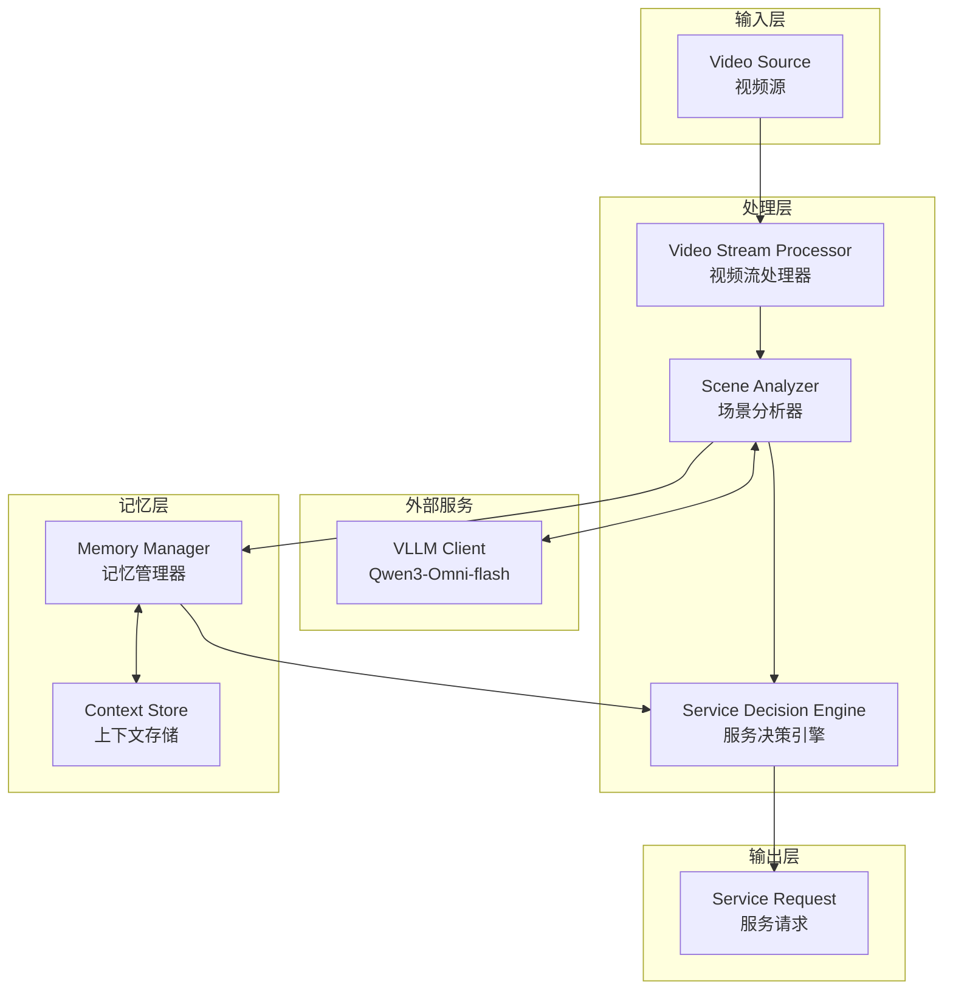
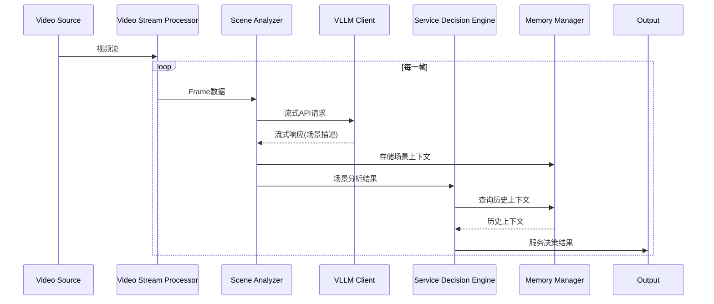

# Design Document: Hearing Impaired Agent

## Overview

本设计文档描述了针对听障人群AI眼镜Agent的主动服务模块架构。该模块负责实时处理视频流，分析场景内容，并智能判断用户是否需要服务以及需要什么类型的服务。

系统采用异步流式处理架构，通过调用阿里云DashScope的Qwen3-Omni-flash模型进行场景分析，支持长时间持续运行并有效管理能耗和记忆存储。

## Architecture



### 数据流



## Components and Interfaces

### 1. Video Stream Processor (视频流处理器)

负责将视频文件作为流处理，逐帧提取并传递给场景分析器。

```python
from dataclasses import dataclass
from typing import AsyncIterator, Optional
import asyncio

@dataclass
class FrameData:
    """视频帧数据"""
    frame_id: int
    timestamp: float
    image_data: bytes  # Base64编码的图像数据
    width: int
    height: int

@dataclass
class ProcessorConfig:
    """处理器配置"""
    sample_rate: int = 1  # 每N帧采样一次
    max_fps: float = 30.0  # 最大处理帧率
    skip_similar_frames: bool = True  # 跳过相似帧
    similarity_threshold: float = 0.95  # 相似度阈值

class VideoStreamProcessor:
    """视频流处理器接口"""
    
    def __init__(self, config: ProcessorConfig):
        self.config = config
    
    async def process_video(self, video_path: str) -> AsyncIterator[FrameData]:
        """
        将视频文件作为流处理，异步生成帧数据
        
        Args:
            video_path: 视频文件路径
            
        Yields:
            FrameData: 提取的帧数据
        """
        pass
    
    async def process_stream(self, stream_source: str) -> AsyncIterator[FrameData]:
        """
        处理实时视频流
        
        Args:
            stream_source: 流源地址
            
        Yields:
            FrameData: 提取的帧数据
        """
        pass
```

### 2. VLLM Client (VLLM客户端)

负责与阿里云DashScope API通信，调用Qwen3-Omni-flash模型。

```python
from dataclasses import dataclass
from typing import AsyncIterator

@dataclass
class VLLMConfig:
    """VLLM客户端配置"""
    base_url: str = "https://dashscope.aliyuncs.com/compatible-mode/v1"
    api_key: str = ""
    model: str = "qwen-omni-turbo"
    max_retries: int = 3
    timeout: float = 30.0

@dataclass
class VLLMRequest:
    """VLLM请求"""
    image_data: bytes  # Base64编码的图像
    prompt: str
    
@dataclass
class VLLMStreamChunk:
    """VLLM流式响应块"""
    content: str
    is_final: bool

class VLLMClient:
    """VLLM客户端接口"""
    
    def __init__(self, config: VLLMConfig):
        self.config = config
    
    async def analyze_stream(self, request: VLLMRequest) -> AsyncIterator[VLLMStreamChunk]:
        """
        流式调用VLLM API分析图像
        
        Args:
            request: VLLM请求
            
        Yields:
            VLLMStreamChunk: 流式响应块
        """
        pass
```

### 3. Scene Analyzer (场景分析器)

负责调用VLLM模型分析场景，输出结构化的场景信息。

```python
from dataclasses import dataclass
from typing import List, Optional
from enum import Enum

class UserLocation(Enum):
    """用户位置类型"""
    MEETING_ROOM = "meeting_room"
    BAR = "bar"
    STREET = "street"
    RESTAURANT = "restaurant"
    HOME = "home"
    OFFICE = "office"
    SHOPPING_MALL = "shopping_mall"
    PUBLIC_TRANSPORT = "public_transport"
    UNKNOWN = "unknown"

class UserState(Enum):
    """用户状态类型"""
    WALKING = "walking"
    CYCLING = "cycling"
    DRIVING = "driving"
    SITTING = "sitting"
    STANDING = "standing"
    TALKING = "talking"
    UNKNOWN = "unknown"

@dataclass
class SceneAnalysisResult:
    """场景分析结果"""
    frame_id: int
    timestamp: float
    scene_description: str  # 简单描述画面
    objects: List[str]  # 画面中出现的物体
    user_location: UserLocation  # 用户位置
    user_state: UserState  # 用户状态
    confidence: float  # 分析置信度
    raw_response: str  # 原始VLLM响应

class SceneAnalyzer:
    """场景分析器接口"""
    
    def __init__(self, vllm_client: VLLMClient):
        self.vllm_client = vllm_client
    
    async def analyze_frame(self, frame: FrameData) -> SceneAnalysisResult:
        """
        分析单帧图像
        
        Args:
            frame: 帧数据
            
        Returns:
            SceneAnalysisResult: 场景分析结果
        """
        pass
    
    def build_analysis_prompt(self) -> str:
        """构建分析提示词"""
        pass
```

### 4. Service Decision Engine (服务决策引擎)

负责根据场景分析结果判断是否需要提供服务以及服务类型。

```python
from dataclasses import dataclass
from typing import Optional, List
from enum import Enum

class ServiceType(Enum):
    """服务类型"""
    SOCIAL_TRANSCRIPTION = "social_transcription"  # 社交语言转录文字
    TRAFFIC_SAFETY_ALERT = "traffic_safety_alert"  # 交通场景安全提醒
    NONE = "none"

@dataclass
class ServiceDecision:
    """服务决策结果"""
    frame_id: int
    timestamp: float
    needs_service: bool  # 是否需要服务
    service_type: Optional[ServiceType]  # 服务类型
    reason: str  # 决策原因
    priority: int  # 优先级 (1-10)

class ServiceDecisionEngine:
    """服务决策引擎接口"""
    
    def __init__(self, memory_manager: 'MemoryManager'):
        self.memory_manager = memory_manager
    
    async def decide(self, analysis: SceneAnalysisResult) -> ServiceDecision:
        """
        根据场景分析结果做出服务决策
        
        Args:
            analysis: 场景分析结果
            
        Returns:
            ServiceDecision: 服务决策
        """
        pass
    
    def _is_social_scenario(self, analysis: SceneAnalysisResult) -> bool:
        """判断是否为社交场景"""
        pass
    
    def _is_traffic_scenario(self, analysis: SceneAnalysisResult) -> bool:
        """判断是否为交通场景"""
        pass
```

### 5. Memory Manager (记忆管理器)

负责管理上下文存储，实现滑动窗口机制和能耗优化。

```python
from dataclasses import dataclass, field
from typing import List, Optional, Dict
from collections import deque
import json

@dataclass
class MemoryConfig:
    """记忆管理器配置"""
    max_context_frames: int = 100  # 最大存储帧数
    memory_threshold_mb: float = 100.0  # 内存阈值(MB)
    auto_purge: bool = True  # 自动清理
    persistence_path: Optional[str] = None  # 持久化路径

@dataclass
class ContextEntry:
    """上下文条目"""
    frame_id: int
    timestamp: float
    analysis: 'SceneAnalysisResult'
    decision: Optional['ServiceDecision'] = None

class MemoryManager:
    """记忆管理器接口"""
    
    def __init__(self, config: MemoryConfig):
        self.config = config
        self._context_buffer: deque[ContextEntry] = deque(maxlen=config.max_context_frames)
    
    def store_context(self, entry: ContextEntry) -> None:
        """存储上下文条目"""
        pass
    
    def get_recent_context(self, n: int = 10) -> List[ContextEntry]:
        """获取最近N个上下文条目"""
        pass
    
    def get_memory_usage_mb(self) -> float:
        """获取当前内存使用量(MB)"""
        pass
    
    def purge_old_context(self) -> int:
        """清理旧的上下文数据，返回清理的条目数"""
        pass
    
    def serialize(self) -> str:
        """序列化上下文为JSON"""
        pass
    
    def deserialize(self, data: str) -> None:
        """从JSON反序列化上下文"""
        pass
```

### 6. Main Agent (主Agent)

整合所有组件的主入口。

```python
from dataclasses import dataclass
from typing import AsyncIterator

@dataclass
class AgentConfig:
    """Agent配置"""
    processor_config: ProcessorConfig
    vllm_config: VLLMConfig
    memory_config: MemoryConfig
    low_activity_threshold: float = 0.3  # 低活动阈值
    adaptive_sampling: bool = True  # 自适应采样

@dataclass
class AgentOutput:
    """Agent输出"""
    frame_id: int
    timestamp: float
    scene_analysis: SceneAnalysisResult
    service_decision: ServiceDecision

class HearingImpairedAgent:
    """听障辅助Agent主类"""
    
    def __init__(self, config: AgentConfig):
        self.config = config
        self.processor = VideoStreamProcessor(config.processor_config)
        self.vllm_client = VLLMClient(config.vllm_config)
        self.analyzer = SceneAnalyzer(self.vllm_client)
        self.memory = MemoryManager(config.memory_config)
        self.decision_engine = ServiceDecisionEngine(self.memory)
    
    async def run(self, video_source: str) -> AsyncIterator[AgentOutput]:
        """
        运行Agent处理视频源
        
        Args:
            video_source: 视频文件路径或流地址
            
        Yields:
            AgentOutput: Agent输出结果
        """
        pass
    
    async def _adjust_sampling_rate(self, analysis: SceneAnalysisResult) -> None:
        """根据场景活动度调整采样率"""
        pass
```

## Data Models

### 配置数据模型

```python
@dataclass
class SystemConfig:
    """系统总配置"""
    # 视频处理配置
    sample_rate: int = 1
    max_fps: float = 30.0
    skip_similar_frames: bool = True
    
    # VLLM配置
    vllm_base_url: str = "https://dashscope.aliyuncs.com/compatible-mode/v1"
    vllm_api_key: str = ""
    vllm_model: str = "qwen-omni-turbo"
    vllm_timeout: float = 30.0
    
    # 记忆配置
    max_context_frames: int = 100
    memory_threshold_mb: float = 100.0
    
    # 能耗优化配置
    adaptive_sampling: bool = True
    low_activity_threshold: float = 0.3
    min_sample_rate: int = 1
    max_sample_rate: int = 10
```

### 输出数据模型

```json
{
  "frame_id": 123,
  "timestamp": 1234567890.123,
  "scene_analysis": {
    "scene_description": "一个繁忙的十字路口，有多辆汽车和行人",
    "objects": ["汽车", "行人", "红绿灯", "斑马线"],
    "user_location": "street",
    "user_state": "walking",
    "confidence": 0.92
  },
  "service_decision": {
    "needs_service": true,
    "service_type": "traffic_safety_alert",
    "reason": "用户正在街道上行走，检测到交通场景",
    "priority": 8
  }
}
```


## Correctness Properties

*A property is a characteristic or behavior that should hold true across all valid executions of a system—essentially, a formal statement about what the system should do. Properties serve as the bridge between human-readable specifications and machine-verifiable correctness guarantees.*

### Property 1: Frame Sequential Processing

*For any* video file with multiple frames, when processed by Video_Stream_Processor, the yielded frames SHALL have monotonically increasing frame_id values.

**Validates: Requirements 1.1**

### Property 2: Frame Extraction Count

*For any* video file with N total frames and sample_rate S, the Video_Stream_Processor SHALL yield approximately N/S frames (within rounding tolerance).

**Validates: Requirements 1.2**

### Property 3: Corrupted Frame Resilience

*For any* video stream containing corrupted frames, the Video_Stream_Processor SHALL continue processing subsequent valid frames without terminating.

**Validates: Requirements 1.4**

### Property 4: Stream Mode Always Enabled

*For any* VLLM API request made by the system, the stream parameter SHALL be set to True.

**Validates: Requirements 2.1, 2.3**

### Property 5: Analysis Prompt Completeness

*For any* analysis prompt generated by Scene_Analyzer, the prompt SHALL contain requests for: scene description, objects, user location, and user state.

**Validates: Requirements 2.4**

### Property 6: Retry with Exponential Backoff

*For any* failed VLLM API call, the Scene_Analyzer SHALL retry up to 3 times, with each retry delay being greater than the previous delay.

**Validates: Requirements 2.6**

### Property 7: SceneAnalysisResult Structure Completeness

*For any* SceneAnalysisResult returned by Scene_Analyzer, it SHALL contain: non-empty scene_description, objects list, valid UserLocation enum value, and valid UserState enum value.

**Validates: Requirements 3.1, 3.2, 3.3, 3.4**

### Property 8: SceneAnalysisResult JSON Round-Trip

*For any* valid SceneAnalysisResult object, serializing to JSON and deserializing back SHALL produce an equivalent object.

**Validates: Requirements 3.5**

### Property 9: ServiceDecision Completeness

*For any* SceneAnalysisResult input, the Service_Decision_Engine SHALL return a ServiceDecision with a valid boolean needs_service field.

**Validates: Requirements 4.1, 4.2**

### Property 10: Service Type Present When Needed

*For any* ServiceDecision where needs_service is True, the service_type field SHALL NOT be None and SHALL be a valid ServiceType enum value.

**Validates: Requirements 4.3**

### Property 11: Scenario-Based Service Recommendation

*For any* SceneAnalysisResult indicating a social scenario (user_location in [MEETING_ROOM, BAR, RESTAURANT] or user_state is TALKING), the recommended service_type SHALL be SOCIAL_TRANSCRIPTION. *For any* SceneAnalysisResult indicating a traffic scenario (user_location is STREET and user_state in [WALKING, CYCLING, DRIVING]), the recommended service_type SHALL be TRAFFIC_SAFETY_ALERT.

**Validates: Requirements 4.5, 4.6**

### Property 12: Sliding Window Memory Limit

*For any* sequence of N context entries stored in Memory_Manager where N > max_context_frames, the stored context SHALL contain exactly max_context_frames entries, retaining only the most recent ones.

**Validates: Requirements 5.1, 5.2**

### Property 13: Memory Threshold Purging

*For any* Memory_Manager state where memory usage exceeds memory_threshold_mb, calling purge_old_context SHALL reduce memory usage below the threshold.

**Validates: Requirements 5.3**

### Property 14: Configurable Sampling Rate Effect

*For any* two Video_Stream_Processor instances with sample_rate S1 and S2 where S1 < S2, processing the same video SHALL result in the first instance yielding more frames than the second.

**Validates: Requirements 5.4**

### Property 15: Adaptive Sampling on Low Activity

*For any* sequence of SceneAnalysisResult with low activity (minimal changes between frames), the system SHALL increase the effective sample_rate to reduce processing frequency.

**Validates: Requirements 5.5**

### Property 16: Context JSON Round-Trip

*For any* valid ContextEntry list stored in Memory_Manager, serializing to JSON and deserializing back SHALL produce an equivalent list.

**Validates: Requirements 5.6**

## Error Handling

### VLLM API Errors

| Error Type | Handling Strategy |
|------------|-------------------|
| Connection Timeout | Retry with exponential backoff (max 3 retries) |
| Rate Limit (429) | Wait for retry-after header duration, then retry |
| Server Error (5xx) | Retry with exponential backoff |
| Invalid Response | Log error, return default SceneAnalysisResult with low confidence |
| Authentication Error (401) | Raise exception, stop processing |

### Video Processing Errors

| Error Type | Handling Strategy |
|------------|-------------------|
| File Not Found | Raise FileNotFoundError |
| Corrupted Frame | Skip frame, log warning, continue processing |
| Unsupported Format | Raise UnsupportedFormatError |
| End of Stream | Gracefully terminate iteration |

### Memory Management Errors

| Error Type | Handling Strategy |
|------------|-------------------|
| Memory Threshold Exceeded | Auto-purge oldest entries |
| Serialization Error | Log error, skip persistence |
| Deserialization Error | Log error, start with empty context |

## Testing Strategy

### Property-Based Testing Framework

本项目使用 **Hypothesis** 作为Python的属性测试框架。

```python
from hypothesis import given, strategies as st, settings

# 配置：每个属性测试至少运行100次迭代
@settings(max_examples=100)
```

### Unit Tests

单元测试用于验证特定示例和边界情况：

1. **VideoStreamProcessor Tests**
   - 测试空视频文件处理
   - 测试单帧视频处理
   - 测试不同采样率配置

2. **VLLMClient Tests**
   - 测试API请求格式
   - 测试流式响应解析
   - 测试错误重试逻辑

3. **SceneAnalyzer Tests**
   - 测试提示词生成
   - 测试响应解析
   - 测试枚举值映射

4. **ServiceDecisionEngine Tests**
   - 测试社交场景识别
   - 测试交通场景识别
   - 测试边界情况（未知场景）

5. **MemoryManager Tests**
   - 测试空缓冲区操作
   - 测试满缓冲区操作
   - 测试序列化/反序列化

### Property-Based Tests

属性测试用于验证普遍性质：

| Property | Test Description | Min Iterations |
|----------|------------------|----------------|
| P1 | 生成随机帧序列，验证frame_id单调递增 | 100 |
| P2 | 生成随机视频长度和采样率，验证输出帧数 | 100 |
| P3 | 注入随机损坏帧，验证处理继续 | 100 |
| P4 | 拦截所有API请求，验证stream=True | 100 |
| P5 | 生成随机帧，验证提示词包含所有字段 | 100 |
| P6 | 模拟随机失败，验证重试行为 | 100 |
| P7 | 生成随机分析结果，验证结构完整性 | 100 |
| P8 | 生成随机SceneAnalysisResult，验证JSON往返 | 100 |
| P9 | 生成随机场景，验证决策完整性 | 100 |
| P10 | 生成需要服务的场景，验证service_type非空 | 100 |
| P11 | 生成社交/交通场景，验证服务类型匹配 | 100 |
| P12 | 生成超过限制的条目，验证滑动窗口 | 100 |
| P13 | 模拟高内存使用，验证清理行为 | 100 |
| P14 | 生成不同采样率，验证帧数关系 | 100 |
| P15 | 生成低活动场景序列，验证采样率调整 | 100 |
| P16 | 生成随机上下文列表，验证JSON往返 | 100 |

### Test Annotation Format

每个属性测试必须包含注释引用设计文档中的属性：

```python
# Feature: hearing-impaired-agent, Property 8: SceneAnalysisResult JSON Round-Trip
# Validates: Requirements 3.5
@given(st.builds(SceneAnalysisResult, ...))
@settings(max_examples=100)
def test_scene_analysis_result_json_roundtrip(result: SceneAnalysisResult):
    """For any valid SceneAnalysisResult, JSON round-trip produces equivalent object."""
    serialized = result.to_json()
    deserialized = SceneAnalysisResult.from_json(serialized)
    assert result == deserialized
```
